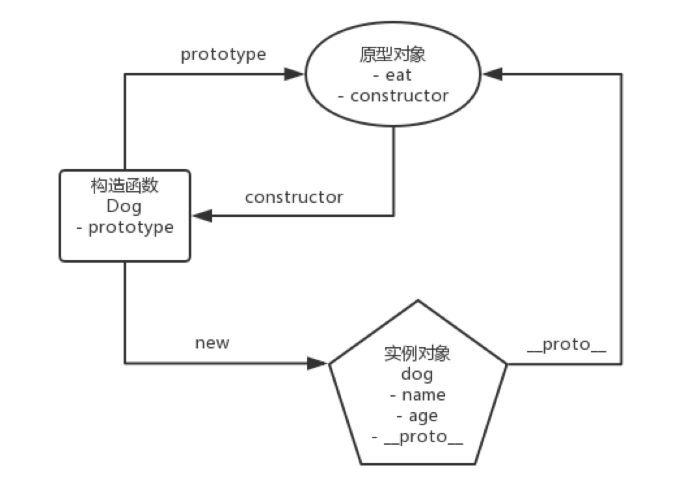

## 原型模式-原型范式

原型模式不仅是一种设计模式，它还是一种 **编程范式（program paradigm）**,是javascript面向对象系统实现的根基。

在原型模式下，当我们想要创建一个对象时，会先找到一个对象作为原型，然后通过克隆原型的方式来创建出一个 **原型一样（共享一套数据/方法）**的对象。 在javascript里，`Obeject.create()`方法就是原型模式的天然实现。只要我们在借助`prototype`来实现对象的创建和原型的继承，那我们就是在应用原型模式。

有的设计模式资料中会强调，原型模式就是拷贝出一个新对象，认为在 JavaScript 类里实现了深拷贝方法才算是应用了原型模式。这是非常典型的对 JAVA/C++ 设计模式的生搬硬套，更是对 JavaScript 原型模式的一种误解。事实上，在JAVA中，确实存在原型模式相关的克隆接口规范。但在 JavaScript 中，我们使用原型模式，并不是为了得到一个副本，而是为了得到与构造函数（类）相对应的类型的实例、实现数据/方法的共享。克隆是实现这个目的的方法，但克隆本身并不是我们的目的。

## 以`类`为中心的语言和以`原型`为中心的语言
### Java中的类
作为 JavaScript 开发者，我们确实没有别的选择 —— 毕竟开头我们说过，原型模式是 JavaScript 这门语言面向对象系统的根本。但在其它语言，比如 JAVA 中，类才是它面向对象系统的根本。所以说在 JAVA 中，我们可以选择不使用原型模式 —— 这样一来，所有的实例都必须要从类中来，当我们希望创建两个一模一样的实例时，就只能这样做（假设实例从 Dog 类中来,必传参数为姓名、性别、年龄和品种）：

```java
Dog dog = new Dog('旺财', 'male', 3, '柴犬')

Dog dog_copy = new Dog('旺财', 'male', 3, '柴犬')
```

没错，我们不得不把一模一样的参数传两遍，非常麻烦。而原型模式允许我们通过调用克隆方法的方式达到同样的目的，比较方便，所以 Java 专门针对原型模式设计了一套接口和方法，在必要的场景下会通过原型方法来应用原型模式。当然，在更多的情况下，Java 仍以“实例化类”这种方式来创建对象。

**所以说在以类为中心的语言中，原型模式确实不是一个必选项，它只有在特定的场景下才会登场。**

### Javascript中的`类`

> ECMAScript 2015 中引入的 JavaScript 类实质上是 JavaScript 现有的基于原型的继承的语法糖。类语法不会为 JavaScript 引入新的面向对象的继承模型。 ——MDN

当我们尝试用 class 去定义一个 Dog 类时：
```js
class Dog {
  constructor(name ,age) {
   this.name = name
   this.age = age
  }
  
  eat() {
    console.log('肉骨头真好吃')
  }
}
```

其实完全等价于写了这么一个构造函数:

```js
function Dog(name, age) {
  this.name = name
  this.age = age
}

Dog.prototype.eat = function() {
  console.log('肉骨头真好吃')
}
```

所以说 JavaScript 这门语言的根本就是原型模式。在 Java 等强类型语言中，原型模式的出现是为了实现类型之间的解耦。而 JavaScript 本身类型就比较模糊，不存在类型耦合的问题，所以说咱们平时根本不会刻意地去使用原型模式。因此我们此处不必强行把原型模式当作一种设计模式去理解，把它作为一种编程范式来讨论会更合适。


## 谈原型模式，其实是在谈原型范式

原型编程范式的核心思想是利用原型来描述对象，用实例作为定义对象和继承的基础。在js中，**原型编程范式的体现就是基于原型链的继承** 。 这其中，对原型、原型链的理解是关键。


## 原型
在Javascript中，每个**构造函数**拥有一个`prototype`属性,它指向构造函数的原型对象，这个原型对象中有一个`constructot`属性指向构造函数；每个实例都有一个`__proto__`属性，但我们使用构造函数去创建实例时，实例的`__proto__`属性就会指向构造函数的原型对象。

```js
// 创建一个Dog构造函数
function Dog(name, age) {
  this.name = name
  this.age = age
}

Dog.prototype.eat = function() {
  console.log('肉骨头真好吃')
}

// 使用Dog构造函数创建dog实例
const dog = new Dog('旺财', 3)

```



## 对象的深拷贝 - 没有完美方案

- 取巧的方式 `JSON.stringify()` 配合 `JSON.parse()`

```js
const liLei = {
    name: 'lilei',
    age: 28,
    habits: ['coding', 'hiking', 'running']
}

const liLeiStr = JSON.stringify(liLei)
const liLeiCopy = JSON.parse(liLeiStr)

liLeiCopy.habits.splice(0, 1) 
console.log('李雷副本的habits数组是', liLeiCopy.habits)
console.log('李雷的habits数组是',  liLei.habits)
```


- 递归

```js
function deepClone(obj) {
    // 如果是 值类型 或 null，则直接return
    if(typeof obj !== 'object' || obj === null) {
        return obj
    }
    
    // 定义结果对象
    let copy = {}
    
    // 如果对象是数组，则定义结果数组
    if(obj.constructor === Array) {
        copy = []
    }
    
    // 遍历对象的key
    for(let key in obj) {
        // 如果key是对象的自有属性
        if(obj.hasOwnProperty(key)) {
            // 递归调用深拷贝方法
            copy[key] = deepClone(obj[key])
        }
    }
    
    return copy
} 
```

### 总结：在JS中**深拷贝没有完美方案，每一种方案都有它的边界 case。** 